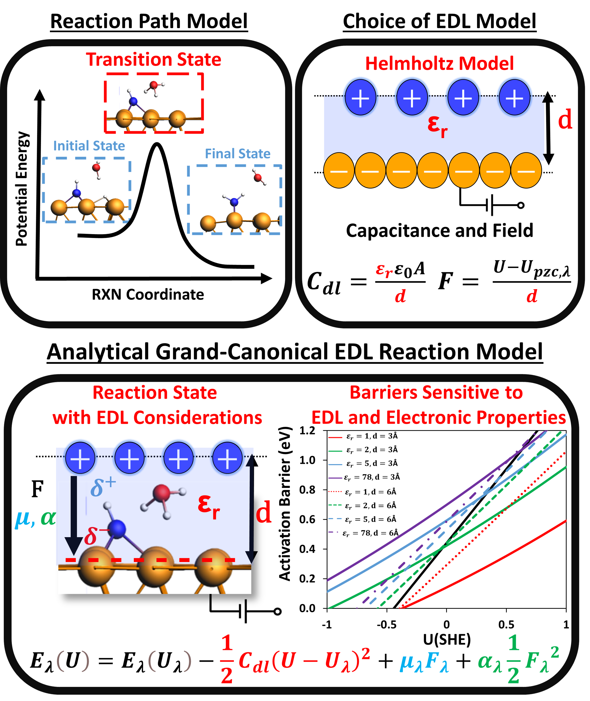

# Analytical Grand-Canonical DFT Approach for the Calculation of Potential-Dependent Electrochemical Activation Energies

# Background
This part of the repository is to provide a tool to calculate potential-dependent electrochemical activation barriers with electrochemical double layer (EDL) consideration using our analytical GC-DFT approach. I have provided several different tools within the repository and links based on your preference, where all tools compute similar sensitivity analysis.

Please read: [Our paper in Journal of Catalysis for more details on the theory and derivation of our approach](https://www.sciencedirect.com/science/article/abs/pii/S0021951724000733). 
Usage of our approach requires citation of this work. 

The main advantage of our approach is to quantify the sensitivity of DFT prediction activation barriers to different types of EDL models and their parameters. Note that our approach uses a simple Helmholtz model to address both the changes in workfunction along the reaction path and the description of the field (Eqs. 14, 20, and 21). In practice, any model of the EDL, capacitance, and the field can be used and rederived. With a Helmholtz model, we can quantify how different reaction energetics and activation barriers change with the dielectric constant and the EDL width w.r.t potential.

# Available Tools 
Python Scripts: Barrier_EDL_Base.py 
Excel Notebook: Excel_Barrier_EDL.xlsx
Jupyter Notebook: Jupyter_Barriers_EDL.ipynb
Bash scripts: polar and getenergies

--General Inputs--

Initial/Final States:
1. DFT Free Energies: Output of DFT energies with corrections (ex: ZPVE, TS) to Free Energies. Note that the reference state and initial state are important to choose. Generally for proton-electron transfer, we use bare surface + $\frac{1}{2}$ H $_2$ and reference to this potential or the H* on the surface and reference to the equilibrium potential of this state. (eV)
2. Dipole Moment: Dipole Moments calculated from VASP (IDIPOL =3, LDIPOL = .TRUE.) for initial and final states. Turning LDIPOL on or off affects the magnitude. Units are e$\AA$
3. Polarizability: Refer to Supplemental Section 3 of how to calculate the polarizability of the surface and the adsorbate. The script corrects for the polarizability to calculate only the polarizability change of the adsorbate, not the metal.  Units are e$\AA$$^2$V$^-1$

Cell Parameters:
4. Volume: Volume of the bare surface slab (ase gui can provide this quickly via quick info) ($\AA$$^3$)
5. Height: Total height of the surface slab ($\AA$)
6. Fermi Energy: Fermi Energy of the bare surface slab. (eV)
7. Vacuum Potential: Vacuum Potential determined from either the WAVECAR or CHGCAR (LVHAR=.TRUE.) (V-abs)
8. Bare Metal Polarizability: Polarizability of the bare metal slab with no adsorbate (Same procedure as Input #3)

Potential Range:
9. Lower Limit: Most Negative (reducing) voltage/potential on a NHE scale
10. Upper Limit: Most Positive (oxidative) voltage/potenital on a NHE scale

EDL Model Parameters:
11. Relative Permittivity: Dielectric Constant of the media within the interface ($\epsilon$ $_r$ = 1 for vacuum or $\epsilon$ $_r$ = 78.4 for bulk water)
12. Width of the EDL: Width is defined as the distance between the electrode surface and the countercharge ions in angstrom ($\AA$)
13. Vacuum to NHE: The voltage correction from absolute scale to NHE scale (commonly as 4.2 V to 4.8 V but test for your system) 
14. Solvation Free Energy Change: This term incorporates the long-range solvation free energy change along the reaction path. Our approach does not include solvation (micro-solvation was included in our work to model H+ shuttling). This term is described as $\Delta$$\Delta$G in units of eV

## Python Notebook: Barrier_EDL_Base.py
This script will compute three figures:
1) Profile of free energy change w.r.t potential for model 1b, 2a,2b, and 2c
2) Decompartmentalization of potential-dependent EDL effects 
3) Total potential-dependent EDL effects 

Note:
1. Cell one is where you define all inputs. The rest of the code may need adjusting of axis given your system for the plots but the general framework should run smoothly. 

### Effects of EDL model on $\Delta$G vs Applied Potential

Here is a sample plot of the free energy change w.r.t the applied potential.

I have listed all electronic and EDL properties on the right. The four regression lines are how $\Delta$G changes w.r.t potential given as the complexities of the EDL model increases (model 1B, 2A, 2B,and 2C). You can see how the symmetry factor also changes with the incorporation of each complexity from the coefficient of the potential-dependent terms. 

### Decompartmentalization of potential-dependent EDL effects 

Using model 2C, we can plot how each of the three EDL complexities (capacitive, dipole-field, and induced dipole-field) change w.r.t potential.

Here is a sample plot of the free energy change w.r.t the applied potential.

The x axis is now plotted versus U-U$_{pzc}$ to quantifies these potential-dependent complexities.

### Total potential-dependent EDL effects

Using model 2C, we can quantify the total EDL effects w.r.t potential as shown below. 

The x axis is againplotted versus U-U$_{pzc}$ to quantifies these potential-dependent complexities.

## Excel Notebook: Excel_Barrier_EDL.xlsx
The script provided reproduces the main plots in the manuscript for calculating the activation barrier of NH* to NH $_2$ * with 2 H $_2$ O molecules. 

--Current Capabilities--
1. Quantification of U $_{pzc}$ of each state along the reaction path using the calculated capacitance of the Helmholtz model
2. Compartmentalized both the potential-dependent and independent EDL term in Figure 3 w.r.t selected $\epsilon_r$ and d. These are quantified for each EDL correction w.r.t potential. 
3. Calculates the sensitivity of the activation barrier w.r.t to potential for different presumed values of $\beta$ using model 1b (Figure 4)
4. Compute the finite cell and explicit electrification terms given the $\epsilon_r$ and d (Figure 5)
5. Calculates the barrier profile w.r.t potential between model 1a,2a,2b, and 2c. The slopes are the symmetry factor along the path. (Figure 6)
6. Sensitivity of activation barriers w.r.t potential given different values of $\epsilon_r$ and d (FIgure 10)

--Notes--
1. Shaded Blue are the inputs in the excel sheet. 
2. Work function is calculated as eU $_{vacuum}$ - E $_{fermi}$
3. Barriers are calculated using the polarizability w.r.t bare metal, using the polarizability change of only the adsorbate along the rxn path.
4. PZC of each state is quantified to show how important it is to consider correcting the workfunction shifts (U $_{pzc}$) along the reaction path.
5. Note the slope and $\beta$ in model 2c is potential-dependent. An effective $\beta$ can be calculated by averaging the $\beta$ over a potential range of interest

## Jupyter Notebook: Jupyter_Barriers_EDL.ipynb

--Current Capabilities--
1. Interactive GUI to input DFT data and model parameters for sensitivity analysis
2. Plots Free Energy Changes wrt. Potential (Potential - Potential of zero charge) given different dielectric constant and width of EDL in a Helmholtz Model
3. Analyzes the magnitude of different complexities of electrification on free energy changes given dielectric constant and width of EDL
4. Sensitivity Analysis due to approximate dielectric constants and widths of the EDL by model 2c via ipywidgets 
5. An interactive symmetry factor ($\beta$) calculator and its sensitivity to approximated EDL widths EDL via ipywidgets
6. Optional gui window that exports data analysis as an excel sheet in the folder of script 

--Notes--
1. Currently the code isn't written to save dictionary results. I am working on to record previous entries via a dropdown menu. 
2. $\beta$ Calculator is calculated for Cation+ transfer (H $^+$ ) from bulk to the surface. Thus, $\beta$ builds from 0 to 1 as the EDL effects and changes in dipole moment/polarizability become more significant (1 is where dipole moment changes, polarizability changes, and EDL is not significant). Simply change e = 0 if you are studying a reaction where H $^+$ is not needed with the transfer of an electron. $\beta$ will then decrease from 1 to 0 as the EDL effects and changes in dipole moment/polarizability become more significant. 
3. Both the $\beta$ calculator and the sensitivity analysis ranges for the dielectric constant and the EDL width can be altered in the function. 
4. The excel sheet is exported to the same folder. I plan to add a feature that it has the option to make entries in different sheets and such.

## Bash Scripts

### polar

This is a simple script I made that sets up polarizability calculations for you given a directory with an optimized geometry. Simply, polar copys the VASP inputs (renames CONTCAR to POSCAR) and creates a directory called "field" where a set of singlepoint vasp calculations of efield from 0.1 to 0.6. These files are copied into each directory and the submission script is executed.
A few notes:
1. You need to change the submission script to match yours. Mine is called "SLURM.VASP". 
2. Feel free to change the script and iterate through the desired range of efield values. I find generally 0 to 0.5 with the five additional single points should suffice in determining the parabola of energy change in an electric field.
    a. I plan to create another script using gnuplot or python that can graph and process the value of the polarizability

### getenergies

This is a script generally nice to have when dealing with multiple VASP calculations in a directory. T
his script is executed as "getenergies path", where the path is the directory (and subdirectories) of interest. It 1) checks if the VASP jobs in the subdirectory are converged and 2) if so, grep the energy from the OUTCAR. 

## Additional tools

### QVASP and VASPKIT
For calculation the Workfunction (potential of zero charges), I recommend both QVASP and VASPKIT as they have an easy way to determine the WF ([Link here](https://sourceforge.net/projects/qvasp/)). If you want to analyze the xy average potenital w.r.t z of your surface, VASPKIT is built into QVASP and you can analyze this. 

# License 
MIT License

Copyright (c) [2024] [Andrew Jark-Wah Wong]

Permission is hereby granted, free of charge, to any person obtaining a copy
of this software and associated documentation files (the "Software"), to deal
in the Software without restriction, including without limitation the rights
to use, copy, modify, merge, publish, distribute, sublicense, and/or sell
copies of the Software, and to permit persons to whom the Software is
furnished to do so, subject to the following conditions:

The above copyright notice and this permission notice shall be included in all
copies or substantial portions of the Software.

THE SOFTWARE IS PROVIDED "AS IS", WITHOUT WARRANTY OF ANY KIND, EXPRESS OR
IMPLIED, INCLUDING BUT NOT LIMITED TO THE WARRANTIES OF MERCHANTABILITY,
FITNESS FOR A PARTICULAR PURPOSE AND NONINFRINGEMENT. IN NO EVENT SHALL THE
AUTHORS OR COPYRIGHT HOLDERS BE LIABLE FOR ANY CLAIM, DAMAGES OR OTHER
LIABILITY, WHETHER IN AN ACTION OF CONTRACT, TORT OR OTHERWISE, ARISING FROM,
OUT OF OR IN CONNECTION WITH THE SOFTWARE OR THE USE OR OTHER DEALINGS IN THE
SOFTWARE.