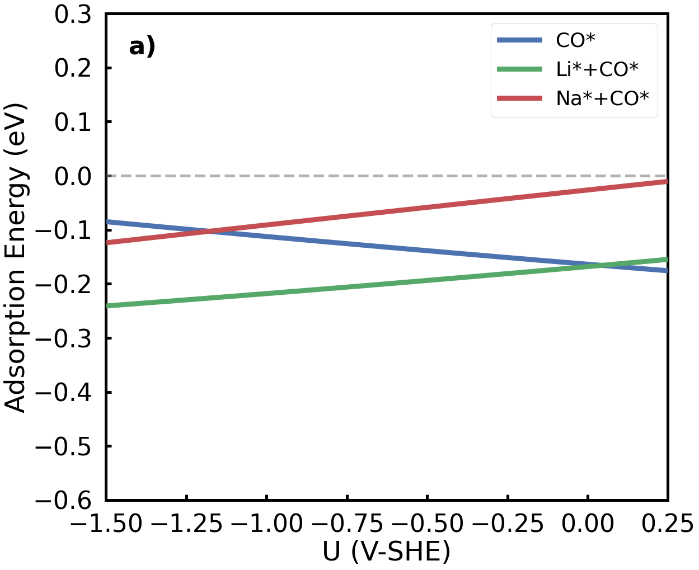
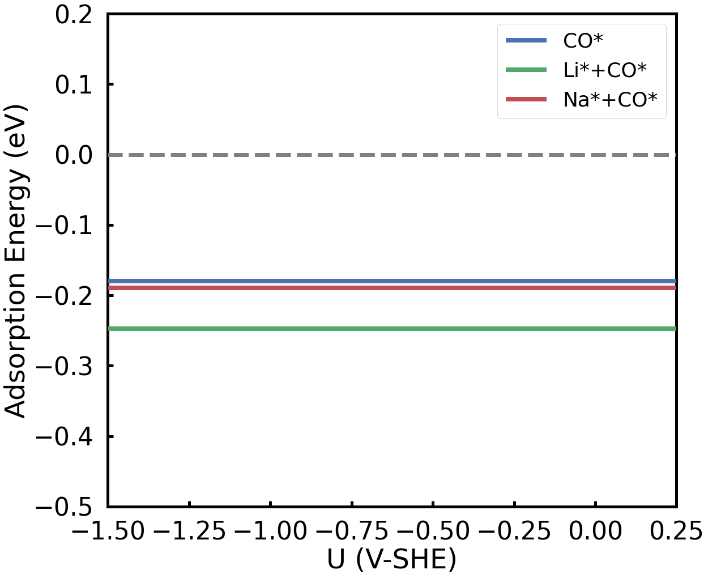
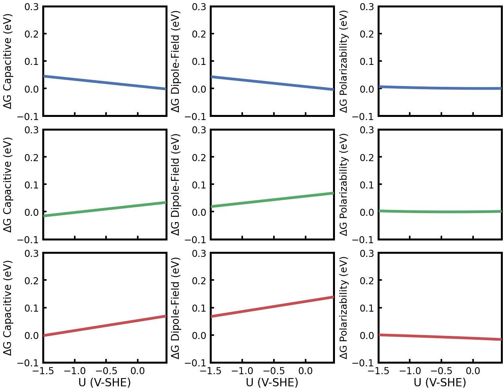
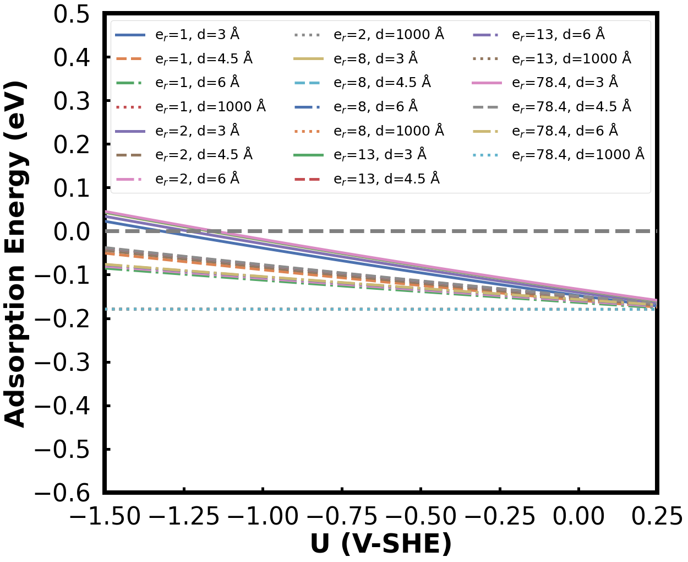
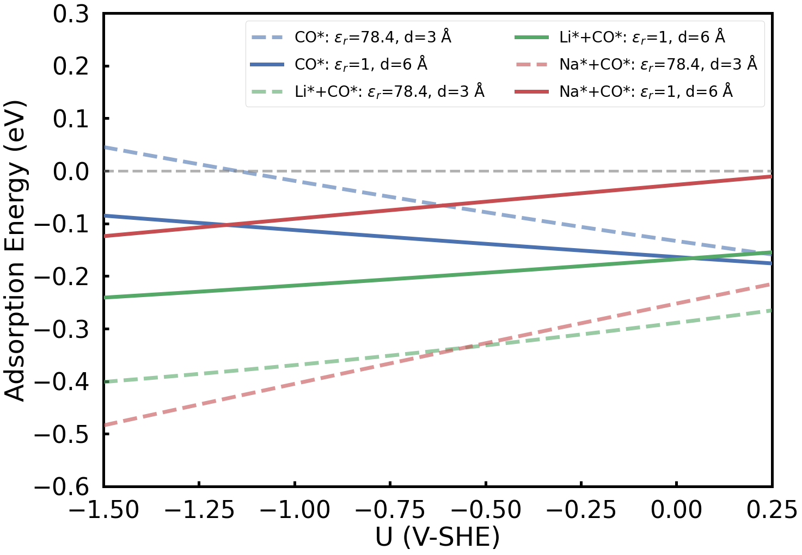

# Potential-dependence of CO* adsorption on Au: Sensitivity due to EDL properties and adsorption model

# Background
This repository uses the analytical Grand Canonical DFT (aGC-DFT) approach to elucidate the sensitivity of electrokinetic barriers based on assumed properties of the EDL. 
Please read: [Our paper in Journal of Catalysis for more details on the theory and derivation of our aGC-DFT approach](https://www.sciencedirect.com/science/article/abs/pii/S0021951724000733). Usage of our approach requires citation of this work. 

Note that our approach uses a simple Helmholtz model to address both the changes in workfunction along the reaction path and the description of the field. In practice, any model of the EDL, capacitance, and the field can be used and rederived. With a simple Helmholtz model, we can easily quantify how different reaction energetics and activation barriers change with the dielectric constant and the EDL width w.r.t potential.

In this work, we focus on using the aGC-DFT approach to investigate the potential-dependent adsorption of CO* reduction on Cu. The available files provided below allows you to reproduce the figures used in this work. By providing the excel sheet and the .py script, you can follow the workflow (and improve it) to easily calculate the sensitivity of potential-dependent barriers (or reaction energies) for your system.

The paper regarding this work is still in review at JACS. Will share once it is published.

# Available Files 
Excel Notebook: DFT_CO_data.xlsx
Python Scripts: CO_Ads_EDL.py

## Excel Notebook: DFT_CO_data.xlsx
I collect data in my excel sheet so it can be converted to dataframes using pandas easily. The columns provided are all what needs to be determined from your DFT model. For more details in calculating polarizability, refer to our paper in Journal of Catalysis.

## Python Script: CO_Ads_EDL.py
This python script analyzes the data from CO_data.xlsx using the aGC-DFT approach.

This script extract data from an excel sheet to create the following plots:
1. Potential-dependent energy change w.r.t one set of EDL properties: dielectric constant and EDL width
2. Potential-independent raw adsorption energies of CO*
3. Compartmentalization of each EDL effect term across different models
4. Sensitivity of free energy change w.r.t potential for a range of EDL properties
5. Main text figure: Potential-dependent CO* adsorption across different EDL and adsorption path models

Examples and a few notes are shown below for each figure.

### 1. Potential-dependent energy change w.r.t one set of EDL properties: dielectric constant and EDL width

Notes: 
1. You need to specify the dielectric constant and Helmholtz width for each reaction
    combinations = {
    0: [ (1, 6)],
    1: [ (1, 6)],
    2: [ (1, 6)]}
2. You need to desired potentials to analyze (The script is set up for analyzing two potentials but of course you can analyze the whole potential range of u)
    volts=[-1.5,1] 

### 2. Potential-independent raw adsorption energies of CO*

Notes: 
1. This is essentially the gas-phase adsorption energies.

### 3. Compartmentalization of each EDL effect term across different models

Notes: 
1. Each row corresponds to the three adsorption models of CO*.
2. Based on the same dielectric widths from Figure 1

### 4. Sensitivity of free energy change w.r.t potential for a range of EDL properties

Notes: 
1. This part of the cell is set up to plot the symmetry factor of a specified reaction based on "M_to_plot"
    Filter results for a specific M[i] (let's say M[0])
    M_to_plot = M[0]
2. The dielectric constant and widths are defined as a list: 
    er = [1,2,8,13,78.4] #Relative permittivity (Dielectric Constant)
    d = [3,4.5,6,1000] #Helmholtz EDL Width in Angstrom

### 5. Main text figure: Potential-dependent CO* adsorption across different EDL and adsorption path models

Notes: 
1. Basically the same as Figure 1 but Specify the combinations of er_val and d_val for each M_val
combinations = {
    0: [(78.4, 3), (1, 6)],
    1: [(78.4, 3), (1, 6)],
    2: [(78.4, 3), (1, 6)]}

## QVASP and VASPKIT
For calculation the Workfunction (potential of zero charges), I recommend both QVASP and VASPKIT as they have an easy way to determine the WF ([Link here](https://sourceforge.net/projects/qvasp/)). If you want to analyze the xy average potenital w.r.t z of your surface, VASPKIT is built into QVASP and you can analyze this. 

# License

MIT License

Copyright (c) [2024] [Andrew Jark-Wah Wong]

Permission is hereby granted, free of charge, to any person obtaining a copy
of this software and associated documentation files (the "Software"), to deal
in the Software without restriction, including without limitation the rights
to use, copy, modify, merge, publish, distribute, sublicense, and/or sell
copies of the Software, and to permit persons to whom the Software is
furnished to do so, subject to the following conditions:

The above copyright notice and this permission notice shall be included in all
copies or substantial portions of the Software.

THE SOFTWARE IS PROVIDED "AS IS", WITHOUT WARRANTY OF ANY KIND, EXPRESS OR
IMPLIED, INCLUDING BUT NOT LIMITED TO THE WARRANTIES OF MERCHANTABILITY,
FITNESS FOR A PARTICULAR PURPOSE AND NONINFRINGEMENT. IN NO EVENT SHALL THE
AUTHORS OR COPYRIGHT HOLDERS BE LIABLE FOR ANY CLAIM, DAMAGES OR OTHER
LIABILITY, WHETHER IN AN ACTION OF CONTRACT, TORT OR OTHERWISE, ARISING FROM,
OUT OF OR IN CONNECTION WITH THE SOFTWARE OR THE USE OR OTHER DEALINGS IN THE
SOFTWARE.
