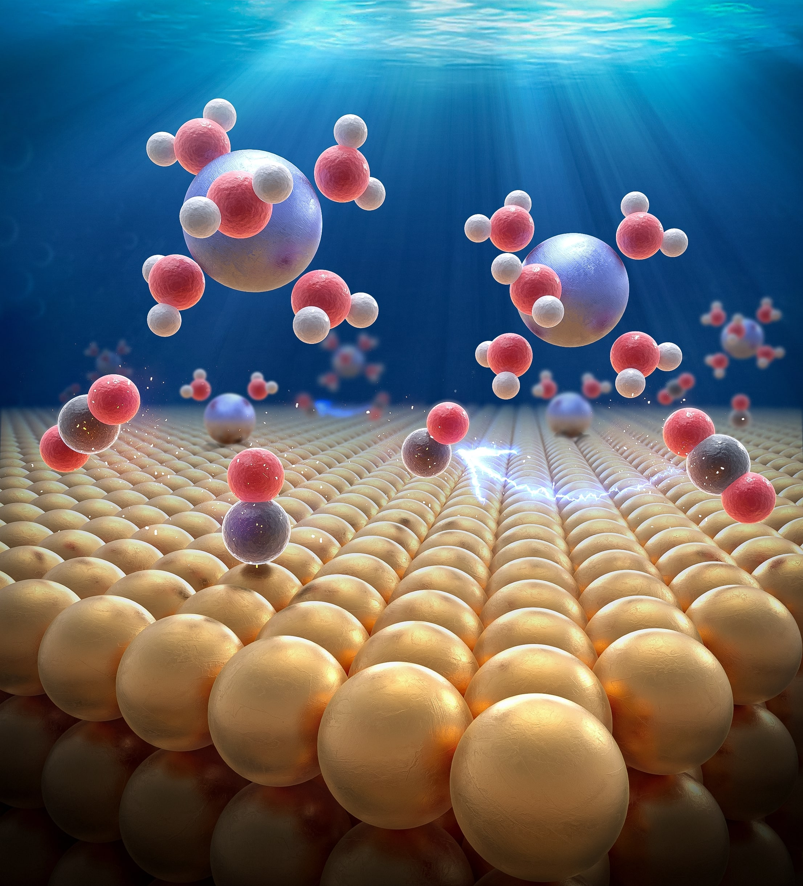

# dft-electrocatalysis-Janik: Repository of Electrocatalysis Modeling Tools
 Tools supporting recent DFT electrocatalytic work in the Dr. Mike Janik group

The purpose of this repository is to provide tools derived from the models and DFT frameworks for modeling electrocatalytic reactions. 

Tools are, not limited to, Jupyter notebooks, Python scripts, excel sheets, and bash scripts for ease of use.
All tools will have the attached paper for further readings about the theory,frameworks, and applications.

# Current tools and manuscripts are as follows:
## Calculating Electrochemical activation barrier and quantifying electrode-electrolyte interfacial effects
Our paper in the Journal of Catalysis [can be read here to learn more about the methodology.](https://www.sciencedirect.com/science/article/abs/pii/S0021951724000733) 

## Sensitivity analysis of Electrochemical Double Layer (EDL) approximation on electrokinetic predictions: CO* Reduction on Cu
Our paper in the Journal of Physical Chemistry C [can be read here.](https://doi.org/10.1021/acs.jpcc.4c01457) 

## Potential-dependent CO* adsorption and its dependence on the EDL properties
Currently in review at Journal of the American Chemical Society.

## Quantifying the Symmetry Factor as a function of the EDL and electronic properties
Currently in review at Angewandte Chemie.

# Additional Information
Each section of the repo has a readme.MD to further explain the details of the tools available. 

Feel free to contact me (Andrew) for questions or suggestions at ajwongphd@gmail.com or jaw6647@psu.edu.
You can also contact Dr. Janik at mjj13@psu.edu for any details as well. 
