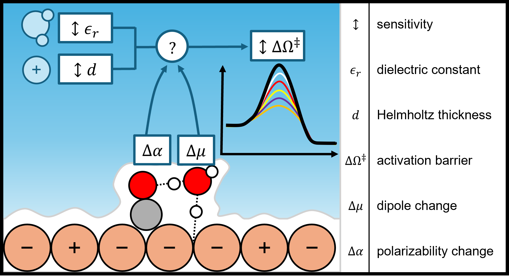
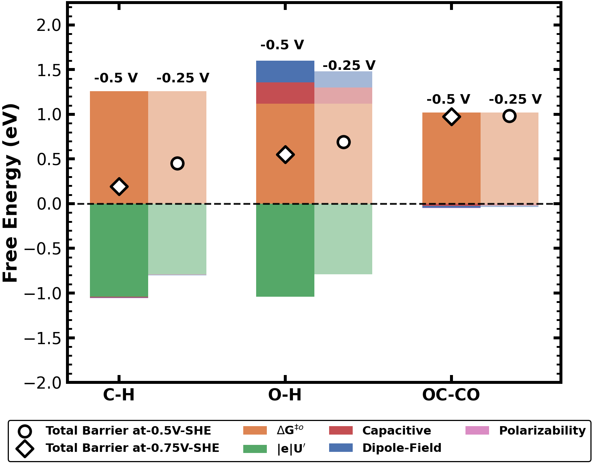
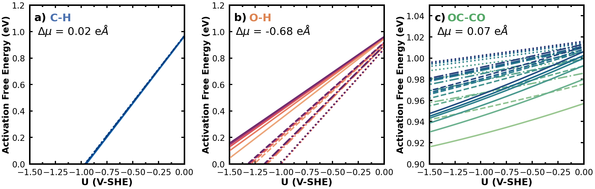
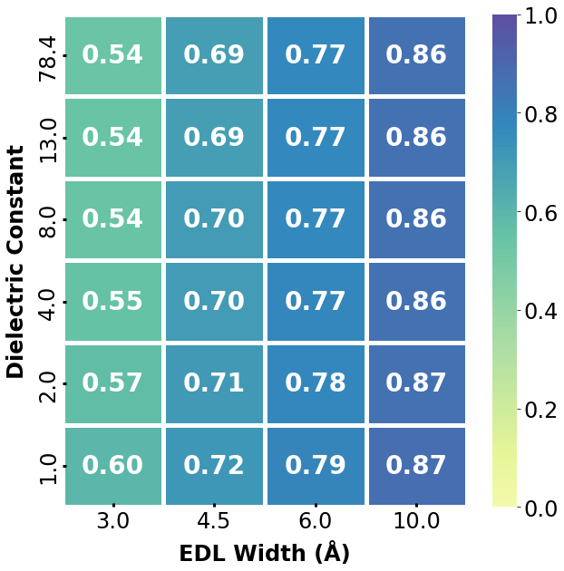

# Sensitivity analysis of Electrochemical Double Layer (EDL) approximation on electrokinetic predictions: CO* Reduction on Cu

# Background
This repository uses the analytical Grand Canonical DFT (aGC-DFT) approach to elucidate the sensitivity of electrokinetic barriers based on assumed properties of the EDL. 
Please read: [Our paper in Journal of Catalysis for more details on the theory and derivation of our aGC-DFT approach](https://www.sciencedirect.com/science/article/abs/pii/S0021951724000733). Usage of our approach requires citation of this work. 

Note that our approach uses a simple Helmholtz model to address both the changes in workfunction along the reaction path and the description of the field. In practice, any model of the EDL, capacitance, and the field can be used and rederived. With a simple Helmholtz model, we can easily quantify how different reaction energetics and activation barriers change with the dielectric constant and the EDL width w.r.t potential.

In this work, we focus on using the aGC-DFT approach to investigate the electrokinetics of CO* reduction on Cu. The available files provided below allows you to reproduce the figures used in this work. By providing the excel sheet and the .py script, you can follow the workflow (and improve it) to easily calculate the sensitivity of potential-dependent barriers (or reaction energies) for your system

# Available Files 
Excel Notebook: CO_data.xlsx
Python Scripts: Barrier_EDL_Base.py and Barrier_E_and_d.py

## Excel Notebook: CO_data.xlsx
I collect data in my excel sheet so it can be converted to dataframes using pandas easily. The columns provided are all what needs to be determined from your DFT model. For more details in calculating polarizability, refer to our paper in Journal of Catalysis.

## Python Script: sensitivityEDL.py
This python script analyzes the data from CO_data.xlsx using the aGC-DFT approach.

Using the Excel Template, this code will provide 3 figures based on the analytical GC-DFT approach:
1. Compartmentalization of potential-dependent contribution on the barrier
2. Sensitivity of barriers based on EDL properties
3. Sensitivity of symmetry factors based on EDL Properties

Examples and a few notes are shown below for each figure.

### 1. Compartmentalization of potential-dependent contribution on the barrier

Notes: 
1. You need to specify the dielectric constant and Helmholtz width for each reaction
    M_values = {'C-H': {'er': 78.4, 'd': 3}, 'O-H': {'er': 78.4, 'd': 3}, 'OC-CO': {'er': 78.4, 'd': 3}}
2. You need to desired potentials to analyze (The script is set up for analyzing two potentials but of course you can analyze the whole potential range of u)
    volts=[-0.5,-0.75] 

### 2. Sensitivity of barriers based on EDL properties

Notes: 
1. You need to specify the dielectric constant and Helmholtz width for each reaction as two lists. It can take as many values as you want (thought the plot may get messy)
    er = [1,2,4,8,13,78.4] #Relative permittivity (Dielectric Constant)
    d = [3,4.5,6,10] #Helmholtz EDL Width in Angstrom
2. Currently, the color palette is set where the darker lines indicate larger dielectric constants. This may need to be adjusted, specifically n_colors.
3. The linestyle changes based on different values of d. This will need to be adjusted if you choose different values. 

### 3. Sensitivity of symmetry factors based on EDL Properties

Notes: 
1. This part of the cell is set up to plot the symmetry factor of a specified reaction based on "desired_M_index"
    desired_M_index = 1  # Change this to the desired index of M where index 1 is O-H
2. The order of the dielectric constant can be adjusted,which uses the same math as Sensitivity of barriers based on EDL Properties 
    custom_order = [78.4, 13, 8, 4, 2.0, 1.0]  # Replace with your desired order

## QVASP and VASPKIT
For calculation the Workfunction (potential of zero charges), I recommend both QVASP and VASPKIT as they have an easy way to determine the WF ([Link here](https://sourceforge.net/projects/qvasp/)). If you want to analyze the xy average potenital w.r.t z of your surface, VASPKIT is built into QVASP and you can analyze this. 

# License

MIT License

Copyright (c) [2024] [Andrew Jark-Wah Wong]

Permission is hereby granted, free of charge, to any person obtaining a copy
of this software and associated documentation files (the "Software"), to deal
in the Software without restriction, including without limitation the rights
to use, copy, modify, merge, publish, distribute, sublicense, and/or sell
copies of the Software, and to permit persons to whom the Software is
furnished to do so, subject to the following conditions:

The above copyright notice and this permission notice shall be included in all
copies or substantial portions of the Software.

THE SOFTWARE IS PROVIDED "AS IS", WITHOUT WARRANTY OF ANY KIND, EXPRESS OR
IMPLIED, INCLUDING BUT NOT LIMITED TO THE WARRANTIES OF MERCHANTABILITY,
FITNESS FOR A PARTICULAR PURPOSE AND NONINFRINGEMENT. IN NO EVENT SHALL THE
AUTHORS OR COPYRIGHT HOLDERS BE LIABLE FOR ANY CLAIM, DAMAGES OR OTHER
LIABILITY, WHETHER IN AN ACTION OF CONTRACT, TORT OR OTHERWISE, ARISING FROM,
OUT OF OR IN CONNECTION WITH THE SOFTWARE OR THE USE OR OTHER DEALINGS IN THE
SOFTWARE.