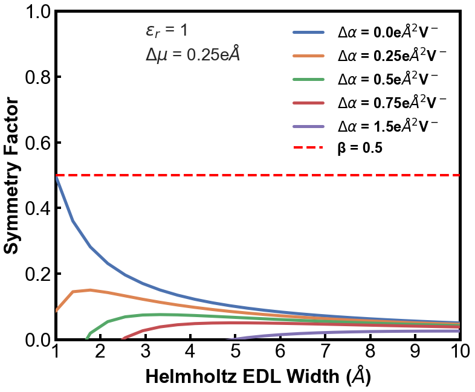

# Changes in Symmetry Factor based on Changes in EDL and Electron Properties 

# Background

In this work, we focus on using the analytical Grand Canonical DFT (aGC-DFT) approach to estimate the symmetry factor ($\beta$). The available python script allows you to calculate $\beta$ for different EDL properties and electronic properties along the reaction path. 

This repository uses the aGC-DFT framework to elucidate the sensitivity of $\beta$ based on assumed properties of the EDL. 
Please read: [Our paper in Journal of Catalysis for more details on the theory and derivation of our aGC-DFT approach](https://www.sciencedirect.com/science/article/abs/pii/S0021951724000733). Usage of our approach requires citation of this work. 

This framework was used to elucidate the reaction state that defines the rate limiting step of CO$_2$ reduction on Au electrodes for different cations. 
Please read: Our paper in Journal of the American Chemical Society for applications of calculating $\beta$ for the studying CO$_2$ reduction.

Note that our approach uses a simple Helmholtz model to address both the changes in workfunction along the reaction path and the description of the field. In practice, any model of the EDL, capacitance, and the field can be used and rederived. With a simple Helmholtz model, we can easily quantify how different $\beta$, reaction energetics, and activation barriers change with the dielectric constant and the EDL width w.r.t potential.

# Available Files 
Python Scripts: beta_calculator.py

# Python Script: beta_calculator.py
Here the python script elucidate the sensitivity of $\beta$ based on the four following parameters:
1. EDL Width (d)
2. Dielectric Constant
3. Magnitude of the Dipole Moment Change
4. Magnitude of the Polarizability Change 

$\beta$ is potential-dependent with the consideration of polarizability. Herein, the $\beta$ computed is a average across a potential range (u), which can be adjusted.
I use the area and U$_{pzc}$ of a Au(111) surface. An common and arbitrary value of $\beta$ = 0.5 is used (red dashed line) to compare DFT predicted values of $\beta$.

## 1. Sensitivity of Symmetry Factors based on EDL Properties

### Dielectric Constant and EDL Width
Here we can see how $\beta$ varies for different EDL widths and dielectric constants. Different EDL widths and $\epsilon$$_r$ are required for $\beta$$_{DFT}$ = 0.5. The $\beta$ is highly sensitive to the chosen value of the EDL width. 

Notes:
1. e_r is a list of dielectric constants that can be studied.
2. d is a list of EDL widths that can be changed
3. The dipole moment change is varied by dm_fin, where the default is set to 1 e$\AA$
4. The polarizability change can be varied as well by varying the polarizability of the final state (polar_fin_un).
    a. Here you need to change the index you want to examine in this list, where desired_index_a = 1 # index of polar and a_dm

## 2. Sensitivity of Symmetry Factors barriers based on EDL properties

### Dipole Moment Change
The magnitude of the dipole moment change is one of the most signficant variables on affecting the profile of the $\beta$.

### Polarizability Change 
The magnitude of the polarizability change affects the profile of the $\beta$.

# License

MIT License

Copyright (c) [2024] [Andrew Jark-Wah Wong]

Permission is hereby granted, free of charge, to any person obtaining a copy
of this software and associated documentation files (the "Software"), to deal
in the Software without restriction, including without limitation the rights
to use, copy, modify, merge, publish, distribute, sublicense, and/or sell
copies of the Software, and to permit persons to whom the Software is
furnished to do so, subject to the following conditions:

The above copyright notice and this permission notice shall be included in all
copies or substantial portions of the Software.

THE SOFTWARE IS PROVIDED "AS IS", WITHOUT WARRANTY OF ANY KIND, EXPRESS OR
IMPLIED, INCLUDING BUT NOT LIMITED TO THE WARRANTIES OF MERCHANTABILITY,
FITNESS FOR A PARTICULAR PURPOSE AND NONINFRINGEMENT. IN NO EVENT SHALL THE
AUTHORS OR COPYRIGHT HOLDERS BE LIABLE FOR ANY CLAIM, DAMAGES OR OTHER
LIABILITY, WHETHER IN AN ACTION OF CONTRACT, TORT OR OTHERWISE, ARISING FROM,
OUT OF OR IN CONNECTION WITH THE SOFTWARE OR THE USE OR OTHER DEALINGS IN THE
SOFTWARE.

